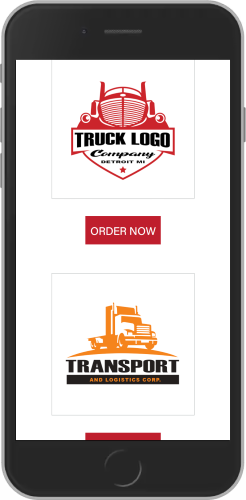
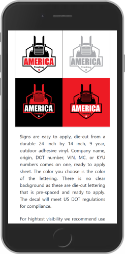
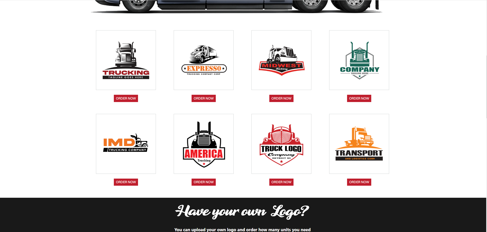
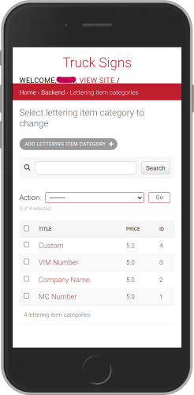

<div align="center">


# Signs for Trucks

     

</div>

## Table of Contents

- [Description](#intro)
- [Structure and Backend Functionalities](#structure)
- [Install (Run) with Docker](#docker)
- [Installation without Docker](#installation)
- [Connect to the Next js Frontend](#connect_backend)
- [Deploy on VPS](#deploy)
- [Screenshots of the Frontend Next js App](#screenshots_frontend)
- [Screenshots of the Django Backend Admin Panel](#screenshots)
- [Useful Links](#useful_links)

<a name="intro"></a>

## Description

**Signs for Trucks** is an online store to buy pre-designed vinyls with custom lines of letters (often call truck letterings). The store also allows clients to upload their own designs and to customize them on the website as well. Aside from the vinyls that are the main product of the store, clients can also purchase simple lettering vinyls with no truck logo, a fire extinguisher vinyl, and/or a vinyl with only the truck unit number (or another number selected by the client).

### Services Explained

**NOTE:** This is also the section _Basic Workflow of the Website_ of the frontend (NEXT js) documentation.

1. **Selecting a pre-designed vinyl or uploading one:** In the principal view of the website (NEXT js frontend) the client can select one of the pre-designed vinyls available to edit, or the client can upload a png, jpg, ... photo to use as the template for the vinyl. After this the client is redirected to the edit-vinyl section.

2. **Editing the selected/uploaded vinyl:** In this page the client selects what lines of lettering should be added to the selected/uploaded vinyl as well as the color of the lettering (note that the background of the vinyl will be the color of the physical truck). The client can also leave a comment about more specific/custom instructions, and should always provide an email to contact or send a pre-view of the product. After this the client is redirected to the make-payment section.

3. **Making a Payment:** The payment is managed via [Stripe](https://stripe.com/). The client should provide the required information that will be processed in the backend (DJANGO API). Then, the vinyl is sent to production.

<a name="structure"></a>

## Structure and Backend Functionalities

The backend functionalities can be divided into 2 categories, those that serve the frontend app (NEXT js), and those used for the administration of the store because the creation of a custom administration panel (aside from the Django Admin) is currently under consideration. Almost all of the views of the app have been created using CBVs.

### Settings

The **settings** folder inside the trucks_signs_designs folder contains the different setting's configuration for each environment (so far the environments are development, docker testing, and production). Those files are extensions of the base.py file which contains the basic configuration shared among the different environments (for example, the value of the template directory location). In addition, the .env file inside this folder has the environment variables that are mostly sensitive information and should always be configured before use. By default, the environment in use is the decker testing. To change between environments modify the \_\_init.py\_\_ file.

### Models

Most of the models do what can be inferred from their name. The following dots are notes about some of the models to make clearer their propose:

- **Category Model:** The category of the vinyls in the store. It contains the title of the category as well as the basic properties shared among products that belong to a same category. For example, _Truck Logo_ is a category for all vinyls that has a logo of a truck plus some lines of letterings (note that the vinyls are instances of the model _Product_). Another category is _Fire Extinguisher_, that is for all vinyls that has a logo of a fire extinguisher.
- **Lettering Item Category:** This is the category of the lettering, for example: _Company Name_, _VIM NUMBER_, ... Each has a different pricing.
- **Lettering Item Variations:** This contains a foreign key to the **Lettering Item Category** and the text added by the client.
- **Product Variation:** This model has the original product as a foreign key, plus the lettering lines (instances of the **Lettering Item Variations** model) added by the client.
- **Order:** Contains the cart (in this case the cart is just a vinyl as only one product can be purchased each time). It also contains the contact and shipping information of the client.
- **Payment:** It has the payment information such as the time of the purchase and the client id in Stripe.

To manage the payments, the payment gateway in use is [Stripe](https://stripe.com/).

### Brief Explanation of the Views

Most of the views are CBV imported from _rest_framework.generics_, and they allow the backend api to do the basic CRUD operations expected, and so they inherit from the _ListAPIView_, _CreateAPIView_, _RetrieveAPIView_, ..., and so on.

The behavior of some of the views had to be modified to address functionalities such as creation of order and payment, as in this case, for example, both functionalities are implemented in the same view, and so a _GenericAPIView_ was the view from which it inherits. Another example of this is the _UploadCustomerImage_ View that takes the vinyl template uploaded by the clients and creates a new product based on it.

<a name="docker"></a>

## Install (Run) with Docker

### About the Builds and Images in use:

There are currently 3 services in use: the api (Django App), the db (the postgrSQL database), and the nginx (Nginx configuration). - **api:** The Django Dockerfile is in the root directory, and it has an entrypoint file that connects the backend to the database and runs migrations as well as collects the statics. - **db:** This is built from the postgres:13-alpine image. The default environment variables are set in the docker-compose.yml file. - **nginx:** The default configuration for nginx is inside the nginx folder in the nginx.conf file.

### Runing Docker-Compose

1. Clone the repo:
   ```bash
   git clone https://github.com/GabrielCopper/truck_backend.git
   ```
1. Configure the environment variables.

   1. Copy the content of the example env file that is inside the truck_signs_designs folder into a .env file:
      ```bash
      cd truck_signs_designs/settings
      cp simple_env_config.env .env
      ```
   1. The new .env file should contain all the environment variables necessary to run all the django app in all the environments. However, the only needed variables for docker to run are the following:
      ```bash
      DOCKER_SECRET_KEY
      DOCKER_DB_NAME
      DOCKER_DB_USER
      DOCKER_DB_PASSWORD
      DOCKER_DB_HOST
      DOCKER_DB_PORT
      DOCKER_STRIPE_PUBLISHABLE_KEY
      DOCKER_STRIPE_SECRET_KEY
      DOCKER_EMAIL_HOST_USER
      DOCKER_EMAIL_HOST_PASSWORD
      ```
   1. For the database, the default configurations should be:
      ```bash
      DOCKER_DB_NAME=docker_trucksigns_db
      DOCKER_DB_USER=docker_trucksigns_user
      DOCKER_DB_PASSWORD=docker_supertrucksignsuser!
      DOCKER_DB_HOST=db
      DOCKER_DB_PORT=5432
      ```
   1. The DOCKER_SECRET_KEY is the django secret key. To generate a new one see: [Stackoverflow Link](https://stackoverflow.com/questions/41298963/is-there-a-function-for-generating-settings-secret-key-in-django)

   1. The DOCKER_STRIPE_PUBLISHABLE_KEY and the DOCKER_STRIPE_SECRET_KEY can be obtained from a developer account in [Stripe](https://stripe.com/).

      - To retrieve the keys from a Stripe developer account follow the next instructions:
        1. Log in into your Stripe developer account (stripe.com) or create a new one (stripe.com > Sign Up). This should redirect to the account's Dashboard.
        1. Go to Developer > API Keys, and copy both the Publishable Key and the Secret Key.

   1. The DOCKER_EMAIL_HOST_USER and the DOCKER_EMAIL_HOST_PASSWORD are the credentials to send emails from the website when a client makes a purchase. This is currently disable, but the code to activate this can be found in views.py in the create order view as comments. Therefore, any valid email and password will work.

1. Run docker-compose:
   ```bash
   docker-compose up --build
   ```
1. Congratulations =) !!! The App should be running in [localhost:80](http://localhost:80)
1. (Optional step) To create a super user run:
   ```bash
   docker-compose run api ./manage.py createsuperuser
   ```

<a name="installation"></a>

## Installation without Docker

1. Clone the repo:
   ```bash
   git clone https://github.com/GabrielCopper/truck_backend.git
   ```
1. Configure a virtual env and set up the database. See [Link for configuring Virtual Environment](https://docs.python-guide.org/dev/virtualenvs/) and [Link for Database setup](https://www.digitalocean.com/community/tutorials/how-to-set-up-django-with-postgres-nginx-and-gunicorn-on-ubuntu-16-04).
1. Configure the environment variables.

   1. Copy the content of the example env file that is inside the truck_signs_designs folder into a .env file:
      ```bash
      cd truck_signs_designs/settings
      cp simple_env_config.env .env
      ```
   1. The new .env file should contain all the environment variables necessary to run all the django app in all the environments. However, the only needed variables for the development environment to run are the following:
      ```bash
      SECRET_KEY
      DB_NAME
      DB_USER
      DB_PASSWORD
      DB_HOST
      DB_PORT
      STRIPE_PUBLISHABLE_KEY
      STRIPE_SECRET_KEY
      EMAIL_HOST_USER
      EMAIL_HOST_PASSWORD
      ```
   1. For the database, the default configurations should be:
      ```bash
      DB_NAME=trucksigns_db
      DB_USER=trucksigns_user
      DB_PASSWORD=supertrucksignsuser!
      DB_HOST=localhost
      DB_PORT=5432
      ```
   1. The SECRET_KEY is the django secret key. To generate a new one see: [Stackoverflow Link](https://stackoverflow.com/questions/41298963/is-there-a-function-for-generating-settings-secret-key-in-django)

   1. The STRIPE_PUBLISHABLE_KEY and the STRIPE_SECRET_KEY can be obtained from a developer account in [Stripe](https://stripe.com/).

      - To retrieve the keys from a Stripe developer account follow the next instructions:
        1. Log in into your Stripe developer account (stripe.com) or create a new one (stripe.com > Sign Up). This should redirect to the account's Dashboard.
        1. Go to Developer > API Keys, and copy both the Publishable Key and the Secret Key.

   1. The EMAIL_HOST_USER and the EMAIL_HOST_PASSWORD are the credentials to send emails from the website when a client makes a purchase. This is currently disable, but the code to activate this can be found in views.py in the create order view as comments. Therefore, any valid email and password will work.

1. Run the migrations and then the app:
   ```bash
   python manage.py migrate
   python manage.py runserver
   ```
1. Congratulations =) !!! The App should be running in [localhost:8000](http://localhost:8000)
1. (Optional step) To create a super user run:
   ```bash
   python manage.py createsuperuser
   ```

<a name="connect_backend"></a>

## Run with the Next js Frontend (with and without Docker)

**Note:** Before following these steps clone this repository. From now on the selected folder that contains the clone will be referred as **project_root**. So far, it should look like this:

```sh
   project_root
   └── truck_signs_api
```

1. Assuming that your are at the **project_root**, clone the [Next js Frontend repository](https://github.com/GabrielCopper/truck_frontend):
   ```sh
      git clone https://github.com/GabrielCopper/truck_frontend.git
   ```
   Now the **project_root** folder should look like:
   ```sh
   project_root
   ├── truck_signs_api
   └── truck_signs_frontend
   ```

- ### If Using Docker and Docker Compose

  1.  Copy the content of the docker-compose-connect.yml to a new file docker-compose.yml in the **project_root**. The docker-compose-connect.yml file can be found at the root of this repository and also at the root of the [Next js Frontend repository](https://github.com/GabrielCopper/truck_frontend) (Either file is fine to copy).
  1.  Follow the instruction to configure the environment variables of the **Next js** frontend that can be found in the section **Install (Run) with Docker** in the Readme.md of the [Next js Frontend repository](https://github.com/GabrielCopper/truck_frontend). The only env variable needed is the Flask Backend url, which by default should be [http://localhost:80](http://localhost:80).
  1.  Follow the instructions on the **Install (Run) with Docker** section of this Readme.md to configure the environment variables for this repo.
      **Note:** Right now the **project_root** should look like:
      ```sh
      project_root
      ├── truck_signs_api
      ├── truck_signs_frontend
      └── docker-compose.yml

      ```

      ```

  1.  Run the command:

      ```bash
      docker-compose up --build
      ```

  1.  Congratulations =) !!! the frontend app should be running in [localhost:3000](http://localhost:3000) while the backend is at [localhost:80](http://localhost:80)

  1.  (Optional step) To create a super user run:

  ```bash
     docker-compose run api ./manage.py createsuperuser
  ```

**NOTE:** To create Truck vinyls with Truck logos in them, first create the **Category** Truck Sign, and then the **Product** (can have any name). This is to make sure the frontend retrieves the Truck vinyls for display in the Product Grid as it only fetches the products of the category Truck Sign.

- ### Running without Docker and Docker Compose
  1.  Follow the instructions of the **Installation without Docker** section in the Readme.md of the [Next js Frontend repository](https://github.com/GabrielCopper/truck_frontend) to configure and run the frontend. Modify the NEXT_PUBLIC_API_DOMAIN_NAME to be the url of the **Django** Backend API (by default it is [http://localhost:8000](http://localhost:8000).
  1.  Follow the instructions of section **Installation without Docker** of this Readme.md.
  1.  Congratulations =) !!! the frontend app should be running in [localhost:3000](http://localhost:3000) while the backend is at [localhost:8000](http://localhost:8000)

**NOTE:** To create Truck vinyls with Truck logos in them, first create the **Category** Truck Sign, and then the **Product** (can have any name). This is to make sure the frontend retrieves the Truck vinyls for display in the Product Grid as it only fetches the products of the category Truck Sign.

---

<a name="deploy"></a>

## Deploy on VPS

1. Clone the repo:
   ```bash
   git clone https://github.com/GabrielCopper/truck_backend.git
   ```
1. Install the dependencies:
   ```bash
   sudo apt-get update
   sudo apt-get install python3-pip python3-dev libpq-dev postgresql postgresql-contrib nginx
   ```
1. Set up the postgresql database [Setup Database](https://www.digitalocean.com/community/tutorials/how-to-set-up-django-with-postgres-nginx-and-gunicorn-on-ubuntu-16-04)
1. Create an .env file and configure the environment variables
1. Create a virtual env and activate it:
   ```bash
   virtualenv myprojectenv
   source myprojectenv/bin/activate
   ```
1. Pip install the requirements:
   ```bash
   pip install -r requirements.txt
   ```
1. Pip install gunicorn:
   ```bash
   pip install gunicorn
   ```
1. Run the migrations and then test the the app:
   ```bash
   python manage.py migrate
   python manage.py runserver
   ```
1. Complete the setup of the website with this [Link](https://www.digitalocean.com/community/tutorials/how-to-set-up-django-with-postgres-nginx-and-gunicorn-on-ubuntu-16-04)
1. Configure the CORS to allow the Frontend to make api calls. See [Link](https://www.stackhawk.com/blog/django-cors-guide/)

<a name="screenshots_frontend"></a>

## Screenshots of the Frontend NEXT JS App

### Mobile View

<div align="center">

  

</div>

<div align="center">

  

</div>

---

### Desktop View



---


---


---

<a name="screenshots"></a>

## Screenshots of the Django Backend Admin Panel

### Mobile View

<div align="center">

  

## </div>

### Desktop View


---


---


<a name="useful_links"></a>

## Useful Links

### Postgresql Databse

- Setup Database: [Digital Ocean Link for Django Deployment on VPS](https://www.digitalocean.com/community/tutorials/how-to-set-up-django-with-postgres-nginx-and-gunicorn-on-ubuntu-16-04)

### Docker

- [Docker Oficial Documentation](https://docs.docker.com/)
- Dockerizing Django, PostgreSQL, guinicorn, and Nginx:
  - Github repo of sunilale0: [Link](https://github.com/sunilale0/django-postgresql-gunicorn-nginx-dockerized/blob/master/README.md#nginx)
  - My repo to Dockerize Django + Postgresql + Nginx + React js: [GabrielCopper/django-react-nginx-mysql-docker](https://github.com/GabrielCopper/django-react-nginx-mysql-docker)
  - Michael Herman article on testdriven.io: [Link](https://testdriven.io/blog/dockerizing-django-with-postgres-gunicorn-and-nginx/)

### Django and DRF

- [Django Official Documentation](https://docs.djangoproject.com/en/4.0/)
- Generate a new secret key: [Stackoverflow Link](https://stackoverflow.com/questions/41298963/is-there-a-function-for-generating-settings-secret-key-in-django)
- Modify the Django Admin:
  - Small modifications (add searching, columns, ...): [Link](https://realpython.com/customize-django-admin-python/)
  - Modify Templates and css: [Link from Medium](https://medium.com/@brianmayrose/django-step-9-180d04a4152c)
- [Django Rest Framework Official Documentation](https://www.django-rest-framework.org/)
- More about Nested Serializers: [Stackoverflow Link](https://stackoverflow.com/questions/51182823/django-rest-framework-nested-serializers)
- More about GenericViews: [Testdriver.io Link](https://testdriven.io/blog/drf-views-part-2/)

### Miscellaneous

- Create Virual Environment with Virtualenv and Virtualenvwrapper: [Link](https://docs.python-guide.org/dev/virtualenvs/)
- [Configure CORS](https://www.stackhawk.com/blog/django-cors-guide/)
- [Setup Django with Cloudinary](https://cloudinary.com/documentation/django_integration)
